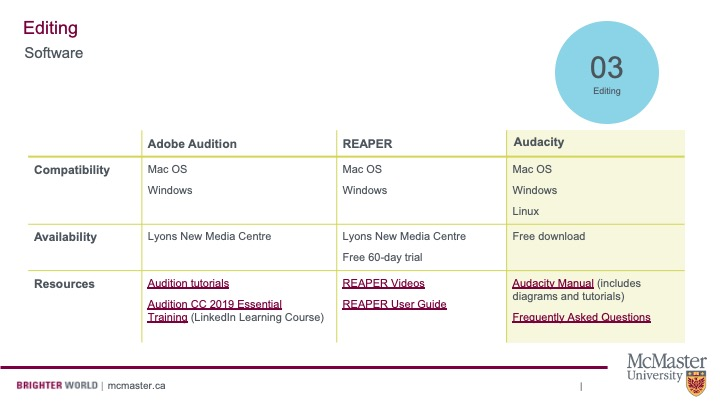

## Before Editing Checklist

Before you begin to edit your podcast, there are a few things you should consider:
- Transfer your audio files to your computer and place them in a folder.
- Sort through your audio files, renaming the files accordingly.
- Create backup copies of your unedited audio files in a separate folder.
- Use headphones instead of solely relying on your computer’s speakers.
- Keep your script nearby – This will act as a guide as you edit.
- And of course, downloading and installing an audio editing program. But which one?

## Choosing an Audio Editor

There are plenty of audio editing tools that you can use. Consult the graph below to choose a software package that will work for you. 

Links to resources in the chart:

[Adobe Tutorials on Audition](https://www.adobe.com/products/audition.html?gclid=Cj0KCQjwuMuRBhCJARIsAHXdnqPBybDTMGOPecaAC1TXJXdzKcYU4E8ZXMy3YLoB51uhgxJGI9M22kYaAhXIEALw_wcB&sdid=KKQPG&mv=search&ef_id=Cj0KCQjwuMuRBhCJARIsAHXdnqPBybDTMGOPecaAC1TXJXdzKcYU4E8ZXMy3YLoB51uhgxJGI9M22kYaAhXIEALw_wcB:G:s&s_kwcid=AL!3085!3!379170499152!b!!g!!%2Baudition!6463395489!76921253229)

[LinkedIn Learning Course on Audition](https://www.linkedin.com/learning/topics/audition?src=go-pa&veh=sem_src.go-pa_c.LLS-C_NAMER_CA_T1_EN-US_SEM_SEM_GoogleAds_NA_All_NA_NA_Core_NA_Course-DSA_Nonbrand_DSA_pkw._pmt._pcrid.447373008606_pdv.c_plc._trgid.dsa-977546883567_net.g_learning&trk=sem_src.go-pa_c.LLS-C_NAMER_CA_T1_EN-US_SEM_SEM_GoogleAds_NA_All_NA_NA_Core_NA_Course-DSA_Nonbrand_DSA_pkw._pmt._pcrid.447373008606_pdv.c_plc._trgid.dsa-977546883567_net.g_learning&mcid=6841846450872316141&cname=&camid=10509116058&asid=103415742185&targetid=dsa-977546883567&crid=447373008606&placement=&dev=c&ends=1&gclid=Cj0KCQjwuMuRBhCJARIsAHXdnqOukwLcyerTBzAKbFtYd84uqWtXgWkOiyfTAqilScMwLEMGPVQ3vXwaAn82EALw_wcB&gclsrc=aw.ds)

[Reaper Videos](https://www.reaper.fm/videos.php)

[Reaper User Guide](https://www.reaper.fm/userguide.php)

[Audacity Manual](https://manual.audacityteam.org/)

[Audacity Frequently Asked Questions](https://manual.audacityteam.org/man/faq.html)

## Learn to Edit Audio on Audacity

Audacity is a free audio editing software. Because of its accessibility, it's our preferred platform. Watch the video below to learn how to use the program:

<iframe height="480" width="853" allowfullscreen frameborder=0 src="https://www.youtube.com/watch?v=ci3QnCj9nHc&t=64s"></iframe>

View the original [here](https://www.youtube.com/watch?v=ci3QnCj9nHc&t=64s).

Now that you've edited your episode, it's time to turn to branding. 
