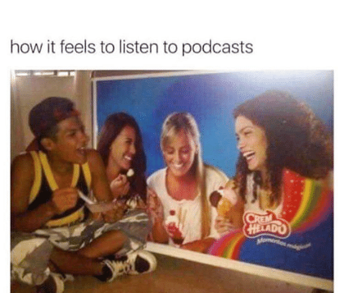

There are so many podcasts these days--over 2 million podcasts and almost 50 million episodes, according Podcast Insights in December 2021. In this saturated field, how will your show find (and keep) its audience?

Finding a keeping an audience is hard work. Outreach and promotion don't happen overnight. In this section, we'll discuss paid and unpaid outreach strategies, plus broader ways to envision your relationship with your listeners. 

Below is a chart breaking down some of the ways you can promote your show, whether you have a budget or not:

Each point in the graph above could be expanded, but here are some top tips:
- Paid ads on popular podcasts can cost thousands of dollars depending on the show's prominence and reach
- It's better to do one social media platform well than to erratically post on six platforms; quality over quantity is key
- Many podcasts find a community hub on private Facebook groups rather than Facebook pages or comments sections on Instagram or Twitter posts; because of this, a Facebook group may be a good place to focus your social media energy
- Another option is to build a website for your show so that you can leverage the power of SEO; however, note that effectively running a website or blog takes time 
- Community > Competition. Similar shows are your friends, not your foes. Try to make genuine connections with your peers. 

However, the chart above is only 30% of the outreach pie. Around 70% of podcast listeners don’t find shows through ads or social media. They find them through recommendations from friends, family, colleagues

So how do you get people to recommend your show?
It’s simple. You create interesting and engaging material. You release it on schedule. You create a relationship with your listener.

This meme is silly but true. A good podcast will make a listener feel like they have a connection with you, that they enjoy spending time with you. You can cultivate this kind of relationship by treating your listener with respect. Of course, this means trying your best to produce great, interesting content. But here are two more areas to focus on:

1. Consistency: If you say that you'll release new episodes on a weekly basis, do so. Consistency is key to the listener/podcaster relationship; it builds the show into your listeners' weekly routines. 

2. Accessibility: Make your show an inclusive space. Create a transcript of your episodes so that people who are hard of hearing can still access your content. 
You can do this manually or use software that will automatically transcribe the audio, then manually correct the transcript (errors are inevitable). 

Auto-Transcript Options include [Microsoft Word](https://shorturl.at/clqwC) and [Otter AI](https://otter.ai/)

Additionally, use a [colour contrast checker tool](https://webaim.org/resources/contrastchecker/) while creating your branding so that everyone can read and understand your logo. 
